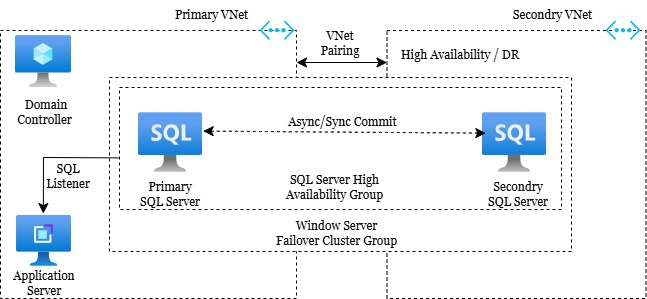

# SQL Server High Availability Group

## Summarize
This setup leverages Windows Server Failover Clustering (WSFC) to provide automatic failover and minimal downtime. SQL Server instances are configured under high availability group as clustered roles in WSFC, sharing storage across nodes to ensure data consistency and continuous availability in the event of hardware or OS failures.

## Azure Services Used
- Resource Groups
- Virtual Networks (Primary and Secondery)
- Domain Controller
- Application Server
- SQL Servers (Primary and Secondry)

## Detailed Discussion 
> to test the high avaialability
> Design The Resource Group and Virtual Networks
