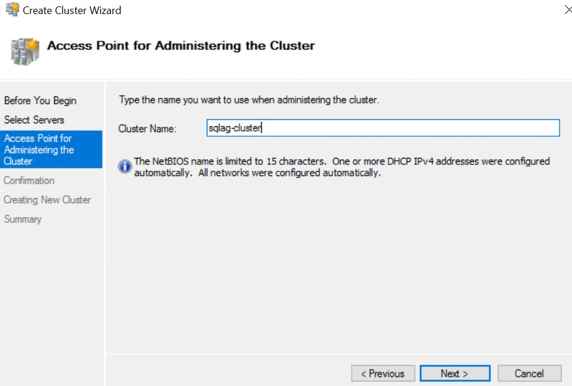
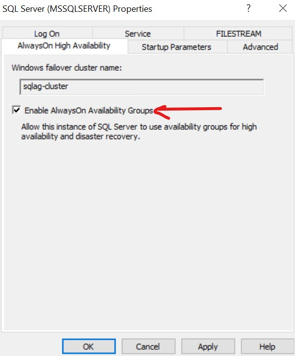
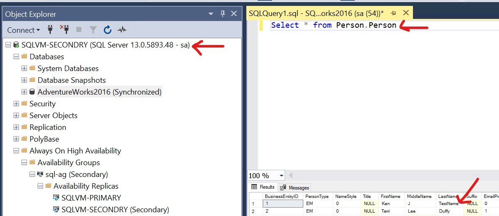
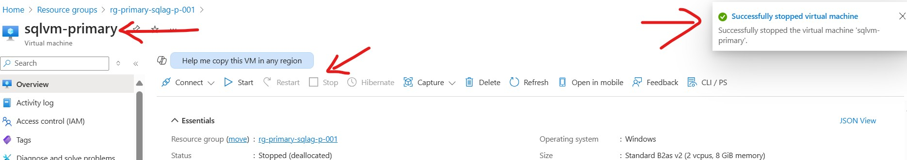

[](LICENSE)
[]()
[]()

## 📖 Overview
>**SQL Server High Availability Group**


### Well, in any production environment, downtime is expensive — both in terms of money and user trust. SQL Server High Availability ensures that your database remains accessible, reliable, and resilient even if a server or component fails.

**The main benefits include:**

- Minimized Downtime: Your applications stay online even during hardware failures or maintenance.
- Automatic Failover: If one node fails, another takes over with minimal disruption.
- Data Protection: Keeps your data safe and synchronized across multiple nodes.
- Improved Performance: Some configurations allow for read-only replicas to handle reporting workloads.
- Compliance & SLA Readiness: Helps meet regulatory and business uptime requirements.

So essentially, HA ensures your SQL Server is always there when your application or users need it.

## ⚙️ Architecture
- **Platform**: Windows Server 2016+ 
- **Database**: SQL Server 2016+ 
- **Cloud**: Azure
- **Cloud Resources**:
  - Resource Groups
  - Virtual Networks (Primary and Secondary)
  - Public IPs
  - Virtual Machines
  - NSG (Network Security Groups)

## 📦 Setup Instructions
Here we will all the steps to perform this activity from beginning to end

> **Please Note:** Above mention application vm could be your any web or windows application server, but for simplicity, keeping another SQL server where from we will test other two SQL servers.

>### 1. Clone Repo and Open In VsCode
After cloning this repository locally, open in VSCode, open terminal mode, reach to folder "Terraform".


>### 2. Infra Setup By Terraform
Logging on the Azure portal and run all the terraform command (Assuming Terraform installed)
  - ``` az login ```
  - ``` az account set --subscription "xxxxxxx-xxxx-xxxx-xxxx-xxxxxxxxxxxx" ```
  - ``` terraform init ```
  - ``` terraform plan -out sqlag.plan ```
  - ``` terraform apply sqlag.plan ```

>### 3. Verify all the Azure services
- As per this tutorial, two resource groups created "**rg-primary-sqlag-p-001**", "**rg-secondary-sqlag-p-001**"
- Two virtual networks (**vnet-primary** and **vnet-secondary**) created in each resource group and having vnet peering.
- Two network security groups (**nsg-primary** and **nsg-secondary**) created enabling 3389 inbound port on both NSGs.
- Three VMs (**applicationvm**, **localad** and **sqlvm-primary**) created in primary resource group and one VM (**sqlvm-secondary**) created in secondary.
- All four VMs having public IPs associated with them.


>### 4. Setup localad as Domain Controller and Create Default user
> <span style="color:red"> Please Note that default credential of all 4 VMs is ***UsernName: adminuser*, *Password: P@ssw0rd123!***</span>

Install ADDS (Active Directory Domain Service) role and promote server as domain controller with new forest "**sqlag.local**" with password "P@ssw0rd123!". Rest click next with default settings and install.


>### 5. Update DNS Server in Azure Virtual Network
Copy private IP of DNS server and update in virtual network DNS.


>### 6. Login all three VMs and update to SQL Authentication Mode
As by default, rest three servers (applicationvm, sqlvm-primary and sqlvm-secondary) having SQL server VMs with windows authentication mode. Update all three VMs to SQL Authentication mode and enabled the "sa" login. Restart the SQL Services from the configuration.


>### 7. Update DNS server in all three VMs by "ipconfig /renew"
By default Azure VM is on default DNS server, which we need to renew by the command ``` ipconfig /renew ``` and check the same by another command ``` ipconfig /all ```


>### 8. Update all three VMs workgroup to local domain.


>Now open the VM by domain controller user.


>### 9. Install and Setup the failover cluster
In both the SQL server VMs (sqlvm-primary and sqlvm-secondary), install the failover cluster and setup as per the below diagrams. During setup the failover cluster, we need to add both VMs by their hostname and choose default for all settings.





> **Need to update cluster IP as per the free IP available in subnet**


>### 10. Setup SQL Server High availability
Now need to turn on the high availability in both SQL servers and switch log on account to domain name.





>### 11. Download Sample DB (Adventure Works) in primary server
You can download the [sample DB](https://learn.microsoft.com/en-us/sql/samples/adventureworks-install-configure?view=sql-server-ver16&tabs=ssms) from here. Restore the DB, Change recovery mode to Full and take full backup.


>### 12. Update the firewall rules in both SQL Servers VMs
Add the inbound firewall rule to allow Port 1433 and 5022 in both servers.


>### 13. Create and Setup the availability group
In this setup, we will add both sql servers as replica. If we want to setup both SQL servers as high Availability then we will choose "Synchronous Commit" else if we want to setup DR (disaster Recover) then we will choose "Asynchronous commit".


#### Remember while setting up the SQL server listener, we will again provide two more free IPs from both the subnets.**


#### Finally both servers will show AdventureWorks DB as synchronized.


#### **Remember Secondary SQL server DB working as Read-Only DB.**


#### Attach the listener IPs into the SQL servers NIC cards


>### 14. Test the Failover

Lets try to update one of the table from the"**Application VM**" by connecting the listener **"sqlag-listener"** and now verify the same on both SQL servers and you will find the updated record.




> Now Lets stop the Primary SQL server and update the record from the Application server and verify from the secondary SQL server. You will also find that secondary server become the primary and Read/Write DB.




> Now Lets start the PrimarySQL Server and stop the secondary SQL server and update the record from the application server and verify again.


---
# 🎉 Completion Note
**Hurrah!**

If you’ve made it this far, congratulations — you’ve successfully configured the SQL Server High Availability Group on a Windows Failover Cluster.

Thanks for your patience and persistence throughout the process!


# 📚 Resources
- [Microsoft Docs: SQL Server AG](https://learn.microsoft.com/en-us/sql/database-engine/availability-groups/windows/overview-of-always-on-availability-groups-sql-server?view=sql-server-ver16)

- [WSFC Guide](https://learn.microsoft.com/en-us/sql/sql-server/failover-clusters/windows/windows-server-failover-clustering-wsfc-with-sql-server?view=sql-server-ver16)


